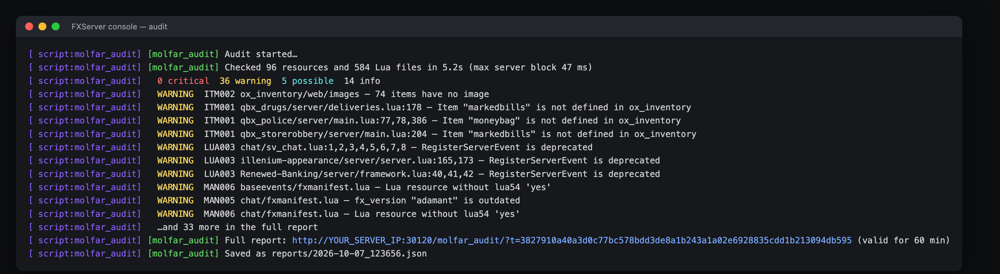
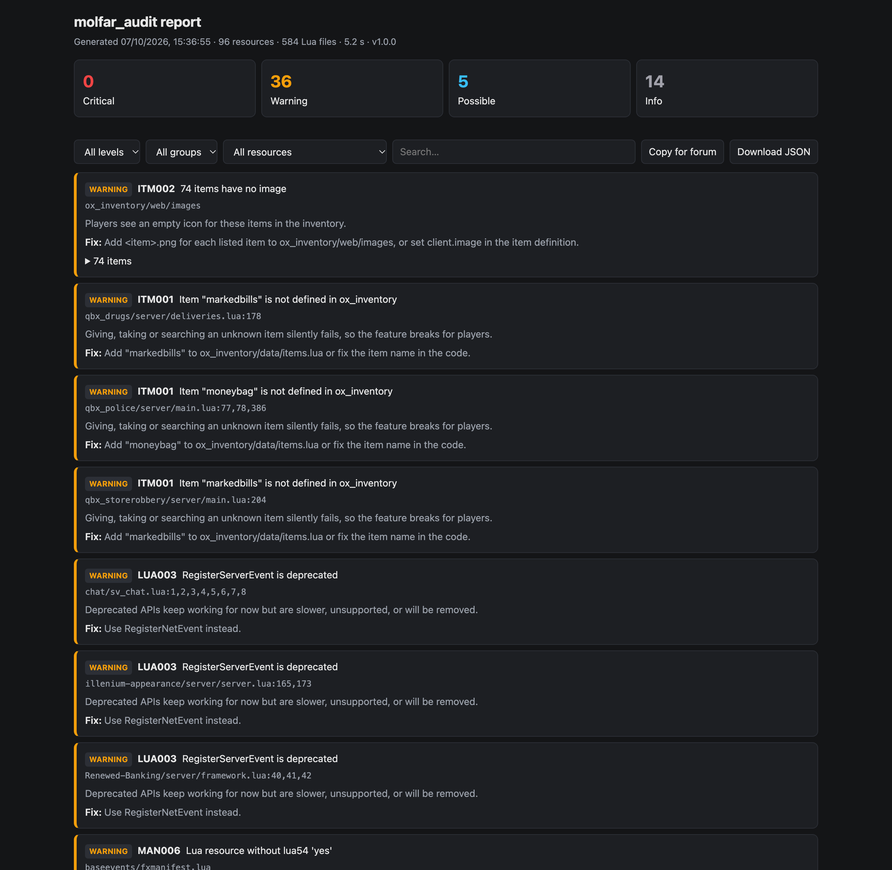

# molfar_audit

**Find broken manifests, missing items, risky server settings and exploitable events — in one command.**

`molfar_audit` is a free FiveM resource that checks your whole server from the server console and gives you a short summary there plus a full, filterable report in your browser. It runs only on the server and nothing is sent to players. Report data never leaves your server; the only outbound requests are the Cfx.re version check (CFG006) and the GitHub update check (both can fail silently, and the update check can be turned off).





On a fresh Qbox recipe server it checks ~110 resources and ~600 Lua files in about 5 seconds, and its longest continuous piece of work stays around 50 ms, so players do not feel it.

## What it checks

Levels: 🔴 **critical** (breaks things or is dangerous) · 🟡 **warning** (worth fixing) · 🔵 **possible** (heuristic, may be wrong) · ⚪ **info**.

### Manifests and resources

| ID | Level | Check |
|---|---|---|
| MAN001 | 🔴 / ⚪ | A dependency does not exist (critical for started resources, info for stopped ones) |
| MAN002 | 🟡 / ⚪ | A dependency exists but is not started |
| MAN003 | 🔴 | A file listed in `fxmanifest.lua` does not exist |
| MAN004 | 🟡 | A manifest pattern (`client/*.lua`) matches no files |
| MAN005 | 🟡 | `fx_version` is missing or outdated (`adamant`, `bodacious`) |
| MAN006 | 🟡 | Lua resource without `lua54 'yes'` |
| MAN007 | 🟡 | `game` is not specified |
| MAN008 | 🟡 | Several resources `provide` the same name |
| MAN009 | 🟡 | A streamed file is larger than 16 MiB |

### ox_inventory items

| ID | Level | Check |
|---|---|---|
| ITM001 | 🟡 | Code gives, takes or searches an item that ox_inventory does not define (`AddItem`, `RemoveItem`, `Search`, `GetItemCount`, QB bridge, ESX, your own functions) |
| ITM002 | 🟡 | Items without an image in `ox_inventory/web/images` (skipped when `inventory:imagepath` points elsewhere) |
| ITM003 | ⚪ | Items never mentioned in any Lua file |

### Server config

| ID | Level | Check |
|---|---|---|
| CFG001 | 🔴 | `sv_scriptHookAllowed` is enabled |
| CFG002 | 🔴 | OneSync is off |
| CFG003 | 🔴 | The database user is `root` or has an empty password |
| CFG004 | 🟡 | `sv_enforceGameBuild` is not set |
| CFG005 | 🟡 | `rcon_password` is set |
| CFG006 | 🟡 | FXServer is older than the build Cfx.re recommends |
| CFG007 | ⚪ | Minor notes (public listing, Steam key, default hostname) |

### Lua code

| ID | Level | Check |
|---|---|---|
| LUA001 | 🔵 | A server net event passes a client value straight into `AddMoney` / `AddItem` / `SetJob` without any check |
| LUA002 | 🔵 | A client loop runs every frame with only `Wait(0)` (loops that must run every frame are recognised) |
| LUA003 | 🟡 | Deprecated APIs: `RegisterServerEvent`, `esx:getSharedObject`, `QBCore:GetObject`, looping over `GetPlayerIdentifiers` |
| LUA004 | ⚪ | Lua files that could not be analysed (including data files over 256 KB, skipped to keep the server smooth) |

CfxLua syntax is supported: backtick hashes, `+=` and friends, `?.`, `<const>`/`<close>`, `/* */` comments, `local a, b in t`. Escrowed files are skipped.

## Requirements

- FXServer **build 35245 or newer** (tested on Linux). Needs `node_version '22'` support.
- ox_inventory for the item checks (other inventories: disable the `items` group).
- Tested on Qbox. QBCore and ESX servers that use ox_inventory should work the same way — reports welcome.

## Installation

1. Download `molfar_audit.zip` from [Releases](https://github.com/molfarlabs/molfar_audit/releases).
2. Extract it into your `resources` folder.
3. Add to `server.cfg`, after your other resources:
   ```
   ensure molfar_audit
   ```
4. Optional, to let in-game admins run it:
   ```
   add_ace group.admin command.audit allow
   ```

## Usage

Type in the server console (or txAdmin Live Console):

```
audit                 full audit
audit items lua       only some groups (manifest, items, config, lua)
audit last            show the link to the last report again
```

The console prints a summary and a link to the full report, valid for 60 minutes. The link is served by your server on its game port: replace `YOUR_SERVER_IP` with your server's IP, or set `web.baseUrl` in `config.json`. Every report is also saved to `molfar_audit/reports/` as JSON.

No console access on your host? Add `set molfar_audit:autorun 60` to `server.cfg` to run the audit 60 seconds after start.

## Configuration

`config.json`:

```jsonc
{
  "command": "audit",                       // console command (falls back to "molfar_audit" if taken)
  "groups": { "manifest": true, "items": true, "config": true, "lua": true },
  "ignore": [],                             // see "False positives"
  "items": { "extraFunctions": [] },        // your own item functions, e.g. { "name": "GiveItem", "argument": 2 }
  "lua": { "sensitiveFunctions": [] },      // extra functions LUA001 treats like AddMoney, e.g. "GiveCash"
  "web": { "enabled": true, "tokenTtlMinutes": 60, "baseUrl": "" },
  "reports": { "keep": 10 },                // JSON reports to keep
  "updateCheck": true                       // print a line when a new release is out
}
```

## False positives

🔵 **possible** findings are heuristics: read the code before changing it. To hide a finding:

- in code, on the same or the previous line:
  ```lua
  Player.Functions.AddMoney('cash', amount) -- molfar-audit-ignore LUA001
  ```
- in `config.json`, by rule, resource (glob) or path (glob, including `[category]` folders):
  ```json
  "ignore": [{ "rule": "LUA002" }, { "resource": "qbx_*", "rule": "LUA003" }, { "path": "[standalone]/**" }]
  ```

Found a false positive that should not happen? [Open an issue](https://github.com/molfarlabs/molfar_audit/issues) with the snippet.

## Security

- The report link carries a random 256-bit token, expires after `tokenTtlMinutes`, and stops working after the next audit.
- After 10 wrong tokens an address is blocked for 10 minutes.
- Reports never contain convar values (license key, RCON and database passwords, Steam key) or absolute server paths.
- Responses are `no-store`, `no-referrer`, cannot be framed, and the page loads nothing from other sites.
- Set `"web": { "enabled": false }` to turn the web report off completely.

## License

MIT — made by [Molfar Labs](https://molfarlabs.com).
